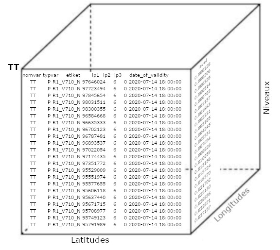

## Fstpy presentation
Sébastien Fortier 2021

---

### Fstpy is Pandas!

---

### Definitions
- FST -> standard files
- model outputs $ CMCGRIDF

---

### Origin
- Need a python interface for Spooki
- Need new memory structure for FST file metadata

---

### What's this?
- High level interface -> rpnpy from rpn
- Produces Dataframes
- Promotes decoupling, modularization and collaboration
- Read, decode attributes and write

---

### Philosophy
- Pythonic method of working with FST files
- No need to know all the mechanisms of rmnlib
- Lots of people come here with knowledge of numpy, pandas and xarray
- Less steep learning curve.

---

### APIs used
- pandas
- numpy
- dask
- xarray


---

### Pandas
- Good for organizing information.
- Integrate new model changes and new data types
- Export our results more easily to different types of formats.
- <https://pandas.pydata.org/>

---

### numpy
- Library to support large multidimensional matrices
- Large collection of high level mathematical functions to operate on these matrices
- <https://numpy.org/>

---

### Dask
- Open source library for parallel computing written in Python
- It is developed in coordination with other community projects like NumPy, pandas and scikit-learn.
- <https://dask.org/>

---

### Xarray
- Organization similar to netCDF format
- Analysis of aggregated and indexed data.
- N-dimensional meteorological data.
- Integrated graphics functions.
- Simplified indexing thanks to the named dimensions
- <http://xarray.pydata.org/en/stable/>

---

#### Standards files


---

### What an FST file looks like
- Table with one record per row

```bash
0 [sbf000 @ eccc3-ppp4 ~ / data] $ see -iment source_data_5005.std

       NOMV TV ETIQUETTE NI NJ NK (DATE-O h m s) IP1 IP2 IP3 DEET NPAS DTY G IG1 IG2 IG3 IG4

    0- HU P R1_V710_N 1108 1082 1 20200714 120,000 95529009 6 0 300 72 f 16 Z 33792 77761 1 0
    1- HU P R1_V710_N 1108 1082 1 20200714 120000 97351772 6 0 300 72 f 16 Z 33792 77761 1 0
    2- GZ P R1_V710_N 1108 1082 1 20200714 120000 95364364 6 0 300 72 f 16 Z 33792 77761 1 0
    3- GZ P R1_V710_N 1108 1082 1 20200714 120000 95357866 6 0 300 72 f 16 Z 33792 77761 1 0
    4- TT P R1_V710_N 1108 1082 1 20200714 120000 95178882 6 0 300 72 f 16 Z 33792 77761 1 0

```

---

### Variables in FST file


---

#### Fstpy


---

### With a Dataframe
```bash
 0 [sbf000 @ eccc3-ppp4 ~ / data] $ python
>>> import fstpy.all as fstpy
>>> df = fstpy.StandardFileReader ('source_data_5005.std'). to_pandas ()
>>> df
     nomvar typvar etiket ni nj nk dateo ip1 ip2 ip3 deet npas datyp nbits grtyp ig1 ig2 ig3 ig4
0 HU P R1_V710_N 1108 1082 1 442998800 95529009 6 0 300 72 134 16 Z 33792 77761 1 0
1 HU P R1_V710_N 1108 1082 1 442998800 97351772 6 0 300 72 134 16 Z 33792 77761 1 0
2 GZ P R1_V710_N 1108 1082 1 442998800 95364364 6 0 300 72 134 16 Z 33792 77761 1 0
3 GZ P R1_V710_N 1108 1082 1 442998800 95357866 6 0 300 72 134 16 Z 33792 77761 1 0
4 TT P R1_V710_N 1108 1082 1 442998800 95178882 6 0 300 72 134 16 Z 33792 77761 1 0
... ... ... ... ... ... ... ... ... ... ... ... ... ... ... ... ... ... ... ...
1869 HF P R1_V710_N 1104 1078 1 442998800 60168832 6 0 300 72 134 12 Z 35132 56748 1 0
1870 FATB P R1_V710_N 1104 1078 1 442998800 60368832 6 0 300 72 134 12 Z 35132 56748 1 0
1871 >> X R1_V710_N 1104 1 1 442998800 35132 56748 1 0 0 5 32 E 1470 560 54400 46560
1872 ^^ X R1_V710_N 1 1078 1 442998800 35132 56748 1 0 0 5 32 E 1470 560 54400 46560
1873 !! X R1_V710_N 3 175 1 0 35132 56748 0 0 0 5 64 X 5005 0 300 1500

[1874 rows x 19 columns]


```
Strangely similar!

---

### Wind modulus
```python
# read file
df = fstpy.StandardFileReader ('source_data_5005.fst'). to_pandas ()
# select all UUs
uu_df = df.loc [df.nomvar == 'UU']
# select all UUs
vv_df = df.loc [df.nomvar == 'VV']
# create a container for the answer
uv_df = copy.deepcopy (uu_df)
for idx in uu_df.index:
     uu = uu_df.at [idx, 'd']
     vv = vv_df.at [idx, 'd']
     uv = np.sqrt (uu ** 2 + vv ** 2)
     uv_df.at [idx, 'd'] = uv

fstpy.StandardFileWriter ('result.fst', uv_df) .to_fst ()
```

---

### version 2
```python
# select all UUs
uu_df = df.loc [df.nomvar == 'UU']
# select all UUs
vv_df = df.loc [df.nomvar == 'VV']

uu = np.stack (uu_df.d)
vv = np.stack (vv_df.d)
uv = np.sqrt (uu ** 2 + vv ** 2) # or np.hypot (uu, vv)
uv_df ['d'] = uv

```

---

### version 3 xarray
```python
# select all UUs
uu_df = df.loc [df.nomvar == 'UU']
# select all UUs
vv_df = df.loc [df.nomvar == 'VV']

uu_da = xr.DataArray (np.stack (uu_df.d))
vv_da = xr.DataArray (np.stack (vv_df.d))
ds = xr.Dataset ({'UU': uu_da, 'VV': vv_da})
uv_da = np.hypot (ds.UU, ds.VV)

```

---

### TT xarray dataset
! [image](dataset.jpg)

---


### Notes
- Documentation on dataframe -> Google
- Help -> Google / Stackoverflow
- Dataframe -> netCDF with direct fstd2nc with Buffer.from_fstpy (df) .to_netcdf ("some_met_data.nc")
- Dataframe -> Xarray with direct fstd2nc with Buffer.from_fstpy (df) .to_xarray ()

---

### Structure
- Sphinx documentation
- Doctest unit tests
- pytest regression tests
- SSM packaging

---

### Connections
- Fstpy documentation <http://web.science.gc.ca/~spst900/fstpy/master/>
- Gitlab <https://gitlab.science.gc.ca/CMDS/fstpy>
- fstd2nc documentation [EC Network] <https://wiki.cmc.ec.gc.ca/wiki/Fstd2nc>
- rpnpy documentation [EC Network] <https://wiki.cmc.ec.gc.ca/wiki/Rpnpy>
- Maestro dask cluster tool <https://gitlab.science.gc.ca/mde000/maestro-dask-cluster>

---

### Questions?


